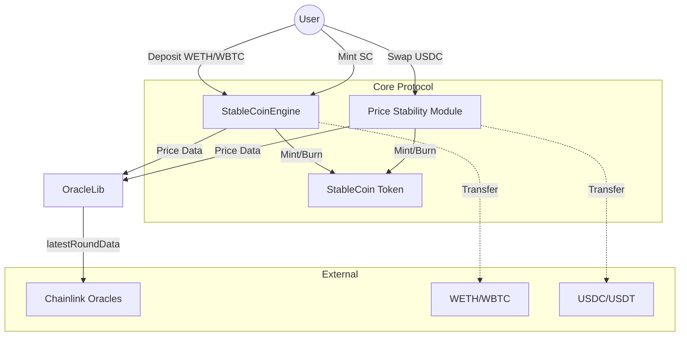

# Architecture Overview

The StableCoin Protocol is a decentralized, over-collateralized stablecoin system inspired by MakerDAO and Liquity, with an additional Price Stability Module (PSM) for peg maintenance.

## System Components

### 1. StableCoin (SC)
The core ERC20 token of the protocol. It is designed to maintain a 1:1 peg with the USD.
- **Roles**: Controlled by `StableCoinEngine` and `PSM` via `MINTER_ROLE` and `BURNER_ROLE`.
- **Standard**: OpenZeppelin ERC20 with AccessControl.

### 2. StableCoinEngine (SCE)
The heart of the protocol, managing Collateralized Debt Positions (CDPs).
- **Collateral**: Supports multiple exogenous collateral types (e.g., WETH, WBTC).
- **Minting**: Users can mint SC by providing collateral above the liquidation threshold (150% collateralization ratio).
- **Liquidation**: Incentivized liquidation process to ensure system solvency when a user's health factor falls below 1.
- **Health Factor**: Calculated as `(Collateral Value * Liquidation Threshold) / Total Debt`.

### 3. Price Stability Module (PSM)
Ensures the 1:1 peg by allowing direct swaps between supported stablecoins (e.g., USDC, USDT) and SC.
- **1:1 Swaps**: Users can swap $1 of USDC for 1 SC (minus fees) and vice versa.
- **Peg Protection**: Swaps are only allowed if the collateral stablecoin is within a tight peg range (0.99 - 1.01 USD).
- **Liquidity**: The PSM holds the collateral stablecoins to back the SC minted through it.

### 4. OracleLib
A safety wrapper for Chainlink Price Feeds.
- **Stale Check**: Reverts if the price data is older than 3 hours.
- **System Freeze**: Proactively freezes the protocol if oracles are unreliable, preventing bad debt or exploitation.

## Component Interaction

## Workflow

### Minting via SCE
1. User deposits collateral (e.g., WETH).
2. User calls `mintStableCoin`.
3. SCE checks the user's Health Factor using OracleLib.
4. If HF >= 1, SCE calls `StableCoin.mint`.

### Swapping via PSM
1. User provides USDC.
2. PSM checks USDC peg via OracleLib.
3. PSM calculates fees and mints SC to the user.
4. USDC is stored in the PSM contract.

### Liquidation
1. A user's collateral value drops, HF < 1.
2. A liquidator calls `liquidate`, providing SC to cover the user's debt.
3. The liquidator receives the user's collateral plus a 10% liquidation bonus.
4. The system's overall health is restored.
